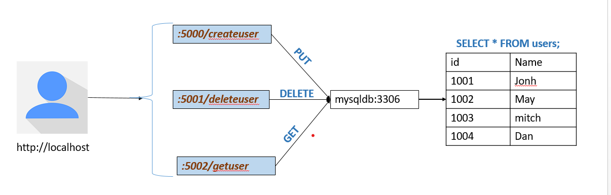

# Flask Microservices with Docker

This project demonstrates a **3-Microservice Architecture** using **Flask**, **Docker**, and a **MySQL** database.  
Each microservice runs in its own isolated container and communicates with a shared database container over a custom Docker network.

**Flowchart**

🧩 Microservices Overview

1️⃣ CreateUser Service : Handles **user creation** and adds records to the MySQL database.

2️⃣ DeleteUser Service : Manages **user deletion** by removing user entries from the database.

3️⃣ GetUser Service : Retrieves **user information** based on the provided user ID.

---

## 🗄️ Database Configuration

- Image:`mysql:8.0-debian`
- Purpose: Centralized database for all microservices.
- Persistence:Data is stored persistently using Docker volumes.

## 📦 Docker Volume for Data Persistence

Database persistence is handled via Docker volume:

Host Path : /mysql

Container Path : /var/lib/mysql

This ensures data is retained even after container restarts.

## API Endpoints

1. CreateUser service:

curl -X PUT http://localhost:5000/createuser -H "Content-Type: application/json" -d '{"id":5122, "name":"Jane Doe"}'

---

2. DeleteUser Service

URL: http://localhost:5001/deleteuser/<user_id>
Method: DELETE

Example:

curl -X DELETE http://localhost:5001/deleteuser \
 -H "Content-Type: application/json" \
 -d '{"id":5122}'

---

3.GetUser Service

URL: http://localhost:5002/getuser
Method: POST

Example:

curl -X POST http://localhost:5002/getuser \
 -H "Content-Type: application/json" \
 -d '{"id":5122}'

---

🐳 Containerization Summary

`1.Each microservice is containerized separately:
2.Independent Dockerfiles per service
3.Shared MySQL database container
4.Connected through my-appnet

---

🚀 Testing Microservices in Bulk

You can automate or stress-test API calls using:

scripts/bulk-api-calls.py
This script sends multiple API requests across services for performance and integration testing.

## Commands to Run the Application##

1. docker network create myapp-net
2. docker run -d -p 5000:5000 --network myapp-net --name createuser-app <createuser-image>
3. docker run -d -p 5001:5001 --network myapp-net --name deleteuser-app <deleteuser-image>
4. docker run -d -p 5002:5002 --network myapp-net --name getuser-app <getuser-image>
5. docker run -d -p 3306:3306 --network myapp-net --name mysql-db -v /mysql:/var/lib/mysql -e MYSQL_ROOT_PASSWORD=$rootpassword mysql:8.0-debian

---
